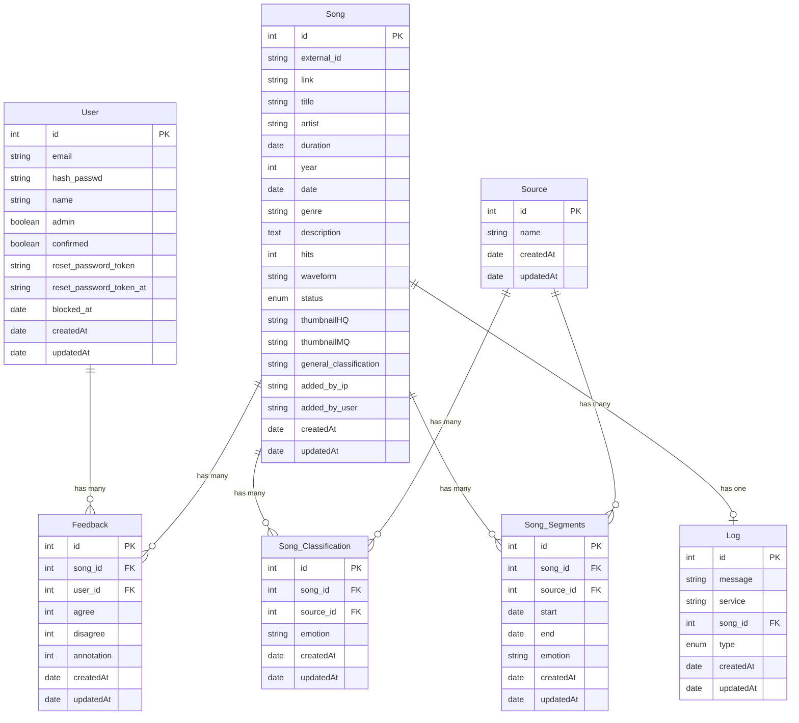

# Project Review: MERmaid API

## Folder Structure

```
/workspaces/mermaid-api
├── 📂 .devcontainer/       # DevContainer configuration for VSCode
│   ├── devcontainer.json   # Main configuration file for the development container
│   ├── docker-compose.extend.yml # Extends the base Docker Compose for dev
│   ├── Dockerfile.devcontainer # Dockerfile for the dev container
├── 📂 dummy-manager/       # Simulated microservice manager
│   ├── dummy-manager.js    # Main script for the dummy manager
│   ├── Dockerfile          # Dockerfile for the dummy manager
│   ├── package.json        # Dependencies for the dummy manager
├── 📂 dummy-service/       # Simulated microservice for classification
│   ├── dummy-service.js    # Main script for the dummy service
│   ├── Dockerfile          # Dockerfile for the dummy service
│   ├── package.json        # Dependencies for the dummy service
├── 📂 dummy-worker/        # Simulated worker for RabbitMQ tasks
│   ├── dummy-worker.js     # Main script for the dummy worker
│   ├── Dockerfile          # Dockerfile for the dummy worker
│   ├── package.json        # Dependencies for the dummy worker
├── 📂 src/                 # Main source code for the API
│   ├── 📂 config/          # Configuration files
│   │   ├── config.js       # Environment-based configuration
│   │   ├── config.json     # Static configuration for Sequelize
│   ├── 📂 controllers/     # Controllers for handling API requests
│   │   ├── FeedbackController.js
│   │   ├── SongClassificationController.js
│   │   ├── SongController.js
│   │   ├── UserController.js
│   ├── 📂 migrations/      # Sequelize migrations for database schema
│   ├── 📂 models/          # Sequelize models for database tables
│   ├── 📂 seeders/         # Seed data for populating the database
│   ├── 📂 Services/        # Utility services (e.g., RabbitMQ)
│   │   ├── rabbitmqService.js
│   ├── 📂 utils/           # Utility functions
│   │   ├── responseFormatter.js
│   ├── .sequelizerc        # Sequelize configuration paths
│   ├── JWT.js              # JWT validation middleware
│   ├── index.js            # Main entry point for the API
│   ├── routes.js           # API route definitions
│   ├── swagger.json        # Swagger documentation for the API
├── 📂 .vscode/             # VSCode-specific settings
│   ├── extensions.json     # Recommended extensions
│   ├── launch.json         # Debugging configuration
│   ├── settings.json       # Editor settings
├── .env.example            # Example environment variables
├── .env.mailcatcher        # MailCatcher-specific environment variables
├── .env.postgresql         # PostgreSQL-specific environment variables
├── .env.rabbitmq           # RabbitMQ-specific environment variables
├── .eslintrc.js            # ESLint configuration
├── .gitattributes          # Git attributes for enforcing LF line endings
├── .gitignore              # Files and folders to ignore in Git
├── .prettierrc.js          # Prettier configuration
├── docker-compose.prod.yml # Docker Compose for production
├── docker-compose.yml      # Docker Compose for development
├── Dockerfile.dev          # Dockerfile for development
├── Dockerfile.prod         # Dockerfile for production
├── nodemon.json            # Nodemon configuration
├── package.json            # Project dependencies and scripts
├── README.md               # Project documentation
├── REVIEW.md               # Project review (this file)
```

## Libraries in Use

### Dependencies

- **amqplib**: ^0.10.3 (RabbitMQ client)
- **async**: ^3.2.4 (Utility for asynchronous operations)
- **axios**: ^1.3.4 (HTTP client)
- **bcrypt**: ^5.1.0 (Password hashing)
- **cors**: ^2.8.5 (Cross-Origin Resource Sharing)
- **dotenv**: ^16.0.3 (Environment variable management)
- **express**: ^4.18.2 (Web framework)
- **express-rate-limit**: ^7.1.1 (Rate limiting middleware)
- **express-validator**: ^6.15.0 (Validation middleware)
- **jsonwebtoken**: ^9.0.0 (JWT handling)
- **nodemailer**: ^6.9.1 (Email sending)
- **pg**: ^8.10.0 (PostgreSQL client)
- **pg-hstore**: ^2.3.4 (PostgreSQL hstore support)
- **sequelize**: ^6.30.0 (ORM for PostgreSQL)
- **socket.io**: ^4.7.1 (WebSocket support)
- **swagger-jsdoc**: ^6.2.8 (Swagger documentation generator)
- **swagger-ui-express**: ^5.0.0 (Swagger UI middleware)
- **youtube-search**: ^1.1.6 (YouTube search API)

### Dev Dependencies

- **eslint**: ^8.57.0 (Linting)
- **eslint-config-prettier**: ^9.1.0 (Prettier integration with ESLint)
- **eslint-plugin-prettier**: ^5.1.3 (Prettier plugin for ESLint)
- **nodemon**: ^3.1.0 (Development server reloader)
- **prettier**: ^3.2.5 (Code formatter)
- **sequelize-cli**: ^6.6.0 (Sequelize CLI)

## Stack

- **Backend Framework**: Node.js with Express.js
- **Database**: PostgreSQL
- **ORM**: Sequelize
- **Message Queue**: RabbitMQ
- **WebSocket**: Socket.IO
- **API Documentation**: Swagger (OpenAPI 3.0)
- **Email Service**: Nodemailer
- **Testing**: Jest (planned but not implemented)
- **Containerization**: Docker (with Docker Compose)
- **Development Tools**: ESLint, Prettier, Nodemon, DevContainers

## Entity-Relationship Diagram (ERD)



## Outdated Dependencies and Vulnerabilities

### Outdated Dependencies

- **`youtube-search`**: Last updated in 2017. Consider replacing it with a more modern library or direct YouTube API integration.
- **`amqplib`**: ^0.10.3. Check for updates to ensure compatibility and security.
- **`express-rate-limit`**: ^7.1.1. Consider updating to the latest version for improved features and fixes.

### Known Vulnerabilities

- **`jsonwebtoken`**: Ensure the version used is not affected by known vulnerabilities (e.g., CVE-2022-23529).
- **`dotenv`**: Ensure sensitive data is not exposed in `.env` files committed to the repository.
- **`bcrypt`**: Ensure the version used is not affected by timing attacks or other vulnerabilities.

## Major Problems and Recommendations

### 1. **Code Quality**

- **Repetitive Logic**: Controllers contain repetitive logic (e.g., `FeedbackController` and `UserController`). Refactor common operations into utility functions.
- **Error Handling**: Error handling is inconsistent. Use a centralized error-handling middleware.
- **Hardcoded Values**: Replace hardcoded values (e.g., YouTube API keys, default genres) with environment variables or configuration files.

### 2. **Security**

- **Sensitive Data**: API keys and secrets are stored in `.env` files. Use a secrets manager for production.
- **JWT Expiry**: Ensure proper handling of expired tokens in `JWT.js`.
- **Rate Limiting**: Add rate limiting to prevent abuse of endpoints.

### 3. **Database**

- **Data Validation**: Add validation rules in Sequelize models to ensure data integrity.
- **Indexes**: Optimize database queries by adding indexes to frequently queried fields (e.g., `email` in `Users`).

### 4. **Testing**

- **Lack of Tests**: No automated tests are implemented. Add unit tests (e.g., Jest) for controllers and services.
- **Mocking External Services**: Mock RabbitMQ and YouTube API in tests to ensure reliability.

### 5. **Documentation**

- **Swagger**: Expand Swagger documentation to include request/response examples and error codes.
- **README**: Add a section on contributing and coding standards.

### 6. **Performance**

- **Database Queries**: Optimize queries in `SongController` (e.g., `filterByName` and `filterByEmotion`).
- **Asynchronous Operations**: Use `Promise.all` where possible to parallelize database operations.

### 7. **Architecture**

- **Microservices**: Replace dummy services with actual microservices for production.
- **Service Layer**: Introduce a service layer to separate business logic from controllers.

### 8. **DevOps**

- **Docker Images**: Optimize Dockerfiles by reducing image size (e.g., multi-stage builds).
- **CI/CD**: Add a CI/CD pipeline for automated testing and deployment.

## Recommendations Summary

1. Refactor repetitive logic into utilities.
2. Secure sensitive data using a secrets manager.
3. Add automated tests with Jest.
4. Expand Swagger documentation.
5. Optimize database queries and add indexes.
6. Replace dummy services with real microservices.
7. Introduce a service layer for better separation of concerns.
8. Implement a CI/CD pipeline for testing and deployment.
